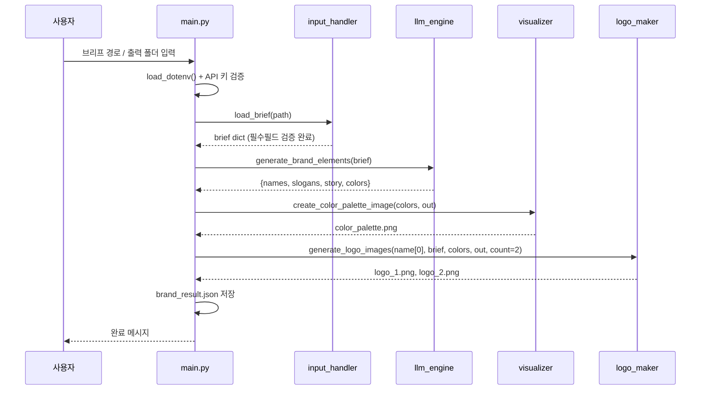

# 🎨 AI 브랜드 아이덴티티 생성기 — 프로젝트 소개 & 결과 정리

> **한 줄 소개**
브리프 JSON 하나를 입력하면 **네이밍 → 슬로건 → 스토리 → 컬러 팔레트 → 로고 시안**까지 자동 생성하는 CLI 프로그램입니다.
LLM API로 텍스트 브랜드 요소를 만들고, 이미지 생성 API로 로고 시안을 뽑아, 모든 결과를 폴더에 저장합니다.
> 

---

## 0. 문서 안내

이 문서는 **제출된 프로그램을 소개하고, 무엇을 어떻게 만들어 무엇이 나왔는지 정리한 보고서**입니다.

| 장 | 내용 |
| --- | --- |
| **1** | 프로젝트 소개 — 무엇을 하는 프로그램인가 |
| **2 ~ 3** | 결과 요약 · 폴더 구성 |
| **4** | 실행 방법 (환경 준비 → 브리프 작성 → 실행) |
| **5** | 코드 구조와 분류 방식 |
| **6** | 파이프라인 단계별 처리 내용 |
| **7** | 실행 결과 정리 (텍스트 · 이미지) |
| **8** | 오류 대응 정리 |
| **9 ~ 10** | 목표 자기점검 · 마무리 요약 |

---

## 1. 프로젝트 소개

### 1-1. 미션이 다루는 문제

브랜드 디자인은 **네이밍, 슬로건, 스토리, 컬러, 로고**를 하나의 맥락 안에서 종합 기획해야 하는 작업입니다. 요소마다 전문성이 필요하고, 그래서 외주 비용도 높게 형성됩니다.

이 미션은 그 과정을 **브리프 한 장으로 자동화하는 CLI 프로그램**을 만드는 것입니다.

### 1-2. 이 프로그램이 하는 일

브리프(업종 · 타겟 · 키워드 · 톤앤매너 등)를 입력하면 **5단계 파이프라인**이 순서대로 실행됩니다.

| 단계 | 하는 일 | 사용하는 도구 | 만들어지는 것 |
| --- | --- | --- | --- |
| **① 입력** | 브리프 JSON을 읽고 필수 항목 검증 | 표준 라이브러리 | 브리프 데이터 |
| **② 텍스트 생성** | 네이밍 · 슬로건 · 스토리 · 컬러를 한 번에 생성 | LLM API | 브랜드 요소 묶음 |
| **③ 팔레트 시각화** | 메인/서브 컬러를 색상 블록 이미지로 렌더링 | matplotlib | `color_palette.png` |
| **④ 로고 생성** | 브랜드명 + 메인 컬러로 로고 시안 생성 | 이미지 생성 API | `logo_1.png`, `logo_2.png` |
| **⑤ 저장** | 텍스트 결과를 JSON으로 통합 저장 | 표준 라이브러리 | `brand_result.json` |

### 1-3. 핵심 설계 포인트

- **텍스트가 이미지의 입력이 되는 구조** — LLM이 뽑은 대표 브랜드명과 메인 컬러를 그대로 로고 생성 프롬프트에 넣습니다.
- **API 키는 코드 밖에서** — 모든 모듈이 `os.getenv()`로만 키를 읽고, 실제 값은 `.env` 파일에 둡니다.
- **모듈 분리** — 입력 / 텍스트 생성 / 시각화 / 이미지 생성이 각각 독립 파일로 나뉘어 있습니다.

---

## 2. 결과 요약

### 2-1. 최종 산출물

| 구분 | 내용 |
| --- | --- |
| **프로그램** | CLI 기반 Python 프로그램 1개 + 기능 모듈 4개 |
| **텍스트 결과물** | 브랜드 네이밍 3개 · 슬로건 3개 · 스토리 1편 (131자) |
| **이미지 결과물** | 컬러 팔레트 1장 · 로고 시안 2장 |
| **데이터 결과물** | `brand_result.json` (UTF-8, 한글 정상 보존) |
| **실행 상태** | 입력 → 생성 → 렌더링 → 저장 **전 구간 완주** |

### 2-2. 생성된 브랜드 한눈에 보기

| 항목 | 결과 |
| --- | --- |
| **브랜드명 (대표)** | **Verda** — 초록을 뜻하는 어감에서 출발, 더 건강한 도시와 지속가능한 미래를 짓겠다는 의미 |
| **대안 네이밍** | Nuvia (New + Via) · Solum (대지·기반) |
| **슬로건** | “미래를 짓는 가장 푸른 기준” |
| **메인 컬러** | `#2F6F4E` (포레스트 그린) |
| **서브 컬러** | `#A8CBB0` · `#F2E8D8` |
| **로고 컨셉** | 자연(잎) + 건축(빌딩/모노그램) 결합, 미니멀 플랫 스타일 |

---

## 3. 폴더 구성

```
📦 프로젝트 루트
├── 🚀 main.py                  # 진입점 · 전체 파이프라인 오케스트레이션
├── 🔍 Check_model.py           # 진단용 유틸 · 사용 가능한 모델 목록 조회
├── 📂 modules/                 # 기능 모듈 (관심사 분리)
│   ├── __pycache__/            # 실행 시 자동 생성 (Python 3.13)
│   ├── input_handler.py        # ① 입력 계층 · JSON 로드 + 필수 필드 검증
│   ├── llm_engine.py           # ② 생성 계층(텍스트) · 브랜드 요소 일괄 생성
│   ├── visualizer.py           # ③ 시각화 계층 · 컬러 팔레트 PNG 렌더링
│   └── logo_maker.py           # ④ 생성 계층(이미지) · 로고 시안 PNG 저장
├── 📂 input/
│   └── brief_sample.json       # 브리프 입력 데이터
├── 📂 output/                  # 실행 결과물
│   ├── brand_result.json       # 텍스트 결과 통합본
│   ├── color_palette.png       # 컬러 팔레트 시각화
│   ├── logo_1.png              # 로고 시안 #1
│   └── logo_2.png              # 로고 시안 #2
├── 🔐 .env                      # API 키 / 엔드포인트 (코드 외부 관리)
└── 📋 requirements.txt          # 의존성 목록
```

### 3-1. 실제 프로젝트 폴더 (실행 환경)

실제 실행 환경에서 프로젝트는 **`brand_generator`** 라는 이름으로 만들어졌으며, `modules/__pycache__/` 안에 컴파일 캐시 파일(`*.cpython-313.pyc`)이 함께 생성되었습니다. → **Python 3.13 환경**에서 실행되었습니다.

| 확인된 항목 | 내용 |
| --- | --- |
| 프로젝트 경로 | `~/Desktop/brand_generator` |
| 실행 환경 | Python 3.13 (`logo_maker.cpython-313.pyc` 캐시 확인) |
| 진단 스크립트 파일명 | `check_model.py` (소문자 시작) |
| output 폴더 | `brand_result.json`, `color_palette.png`, `logo_1.png`, `logo_2.png` — **4개 파일 모두 생성됨** |

> 실행 화면 캡처는 **7장 실행 결과 정리**에 이미지로 함께 실었습니다.
> 

---

## 4. 실행 방법

### 4-1. 환경 준비

```bash
# Python 3.10 이상 권장
python --version

# 의존성 설치
pip install -r requirements.txt
# → python-dotenv, openai, matplotlib, requests
```

### 4-2. API 키 설정 (`.env`)

키는 코드에 직접 쓰지 않고 `.env` 파일로 분리했습니다. 프로그램 시작 시 `load_dotenv()`가 환경변수로 주입합니다.

```
OPENAI_API_KEY=sk-cody-live-****   # 실제 키 값
OPENAI_BASE_URL=https://copa.codyssey.kr/v1
OPENAI_IMAGE_URL=https://copa.codyssey.kr/api/v1/images
```

### 4-3. 브리프 작성 (`input/brief_sample.json`)

```json
{
  "industry": "친환경 건설을 추구하는 건축자재 브랜드",
  "target": "미래기술을 책임지는 모든 건설사",
  "keywords": ["친환경", "안정성", "경제성", "지속가능성", "혁신"],
  "tone": "차분하고 따뜻하며, 전문적이면서도 다가가기 쉬운 느낌",
  "competitors": ["현대건설(Hyundai Engineering & Construction)", "삼성물산(Samsung C&T)", "포스코건설(POSCO E&C)"],
  "notes": "브랜드 이름은 너무 길지 않은 2~3음절의 영문이면 좋겠습니다. 로고는 식물이나 자연의 요소가 들어간 모던한 심볼을 선호합니다."
}
```

| 구분 | 필드 |
| --- | --- |
| **필수** | `industry`, `target`, `keywords` |
| **선택** | `tone`, `competitors`, `notes` |

### 4-4. 실행 순서

```bash
# ① (선택) 사용 가능한 모델 확인 — 진단 스크립트
python Check_model.py

# ② 본 프로그램 실행
python main.py
```

### 4-5. 실행 화면

```
=== 🎨 AI 브랜드 디자인 자동화 CLI ===
브리프 파일 경로를 입력하세요 (예: input/brief_sample.json): input/brief_sample.json
출력 폴더 경로를 입력하세요 (기본값: ./output):

✅ 브리프 로드 완료. [./output] 폴더에 결과를 저장합니다.

▶ [1/3] LLM을 통한 텍스트 브랜드 요소 생성 중...
  ✅ 텍스트 요소 생성 완료
▶ [2/3] 컬러 팔레트 시각화 이미지 생성 중...
  ✅ 컬러 팔레트 이미지 저장 완료
▶ [3/3] 이미지 생성 API를 통한 로고 시안 생성 중...
  ✅ 로고 시안 이미지 저장 완료

✅ 텍스트 결과물이 저장되었습니다: ./output/brand_result.json
🎉 모든 브랜드 디자인 작업이 완료되었습니다!
```

> ℹ️ 텍스트 요소 4종(네이밍·슬로건·스토리·컬러)을 **LLM 1회 호출로 통합 생성**하므로, 화면에는 `[1/3] ~ [3/3]` 3단계로 표시됩니다.
> 

---

## 5. 코드 구조와 분류

### 5-1. 분류 기준 — “관심사 분리(Separation of Concerns)” 계층형 구조

이 프로그램은 **역할별 4계층 + 진입점 1개 + 진단 유틸 1개**로 분류되어 있으며, 모든 모듈이 **한 방향(`main` → `modules`)** 으로만 의존합니다. 모듈끼리 서로를 import하지 않아 순환참조가 없습니다.

**① 모듈 구조**

```
main.py  (진입점 · 오케스트레이터)
 |
 +-- modules/input_handler.py     ->  ① 입력 계층        : JSON 로드 + 필수 필드 검증
 +-- modules/llm_engine.py        ->  ② 생성 계층(텍스트) : LLM 호출 + JSON 파싱
 +-- modules/visualizer.py        ->  ③ 시각화 계층       : matplotlib 팔레트 렌더
 +-- modules/logo_maker.py        ->  ④ 생성 계층(이미지) : Image API + PNG 저장
 |
 +-- Check_model.py  (별도)       ->  진단 유틸          : 모델 목록 조회 (파이프라인 외부)
```

**② 데이터 흐름 (단방향)**

```
brief.json  ->  [ input_handler : 로드·검증 ]  ->  브리프 dict
브리프 dict ->  [ llm_engine   : LLM 생성 ]    ->  결과 dict
결과 dict   ->  [ visualizer   : 팔레트 렌더 ] ->  color_palette.png
결과 dict   ->  [ logo_maker   : 이미지 생성 ] ->  logo_1.png · logo_2.png
결과 dict   ->  [ main.py      : 통합 저장 ]   ->  brand_result.json
```

**③ 계층별 책임 한눈표**

| 분류 | 파일 | 핵심 책임 | 넘겨받는 것 | 넘겨주는 것 |
| --- | --- | --- | --- | --- |
| **진입점** | `main.py` | 파이프라인 조립 · 단계별 예외 격리 · 최종 저장 | CLI 입력 | `brand_result.json` |
| **① 입력 계층** | `modules/input_handler.py` | 파일 로드 + 필수 필드 검증 | 파일 경로 | 브리프 `dict` |
| **② 생성 계층 (텍스트)** | `modules/llm_engine.py` | 브랜드 4요소 생성 | 브리프 `dict` | 결과 `dict` |
| **③ 시각화 계층** | `modules/visualizer.py` | 컬러 팔레트 이미지 렌더 | 색상 `dict` | `color_palette.png` |
| **④ 생성 계층 (이미지)** | `modules/logo_maker.py` | 로고 시안 생성·저장 | 브랜드명 · 브리프 · 색상 | `logo_N.png` |
| **진단 유틸** | `Check_model.py` | 사용 가능한 모델 조회 | — | 콘솔 출력 |
| **설정** | `.env` | 비밀값 외부화 | — | 환경변수 |

### 5-2. 모듈별 책임 분류표

| 분류 | 파일 | 단일 책임 | 입력 | 출력 | 외부 의존 |
| --- | --- | --- | --- | --- | --- |
| **진입점** | `main.py` | 파이프라인 조립·실행·저장 | CLI 입력 | `brand_result.json` | dotenv |
| **입력 계층** | `modules/input_handler.py` | 브리프 로드 + 필수필드 검증 | 파일 경로 | `dict` | 표준 라이브러리만 |
| **생성 계층 · 텍스트** | `modules/llm_engine.py` | 브랜드 4요소 생성 | 브리프 dict | 결과 dict | requests |
| **시각화 계층** | `modules/visualizer.py` | 팔레트 PNG 렌더링 | 색상 dict | `color_palette.png` | matplotlib |
| **생성 계층 · 이미지** | `modules/logo_maker.py` | 로고 시안 생성·저장 | 브랜드명·브리프·색상 | `logo_N.png` | requests, base64 |
| **진단 유틸** | `Check_model.py` | 모델 목록 조회 | — | 콘솔 출력 | requests, dotenv |
| **설정** | `.env` | 비밀값 외부화 | — | 환경변수 | — |

### 5-3. 모듈 간 데이터 계약

`llm_engine`이 반환하고, `visualizer`·`logo_maker`·저장 단계가 소비하는 **단일 스키마**입니다.

```json
{
  "names":   [ { "name": "브랜드명", "meaning": "의미" } ],   // 3개
  "slogans": [ "슬로건1", "슬로건2", "슬로건3" ],               // 3개
  "story":   "브랜드 스토리 (300자 내외 목표)",
  "colors":  { "main": "#HEX", "sub": ["#HEX", "#HEX"] }      // main 1 + sub 2
}
```

> 이 계약이 **코드 · 프롬프트 · 저장 로직에 동일한 형태로 반영**되어 있어, 모듈을 순서대로 조립하기만 하면 파이프라인이 완성되는 구조입니다.
> 

### 5-4. 호출 흐름



---

## 6. 파이프라인 단계별 처리 내용

| 단계 | 담당 모듈 | 처리 내용 |
| --- | --- | --- |
| **[1/3] 텍스트 생성** | `llm_engine.py` | 브리프를 프롬프트에 삽입 → LLM 호출 → JSON 파싱 → 마크다운 펜스 제거 |
| **[2/3] 팔레트 렌더링** | `visualizer.py` | HEX → matplotlib 색상 블록 → 150dpi PNG |
| **[3/3] 로고 생성** | `logo_maker.py` | 프롬프트 생성 → 이미지 API ×2회 → b64 디코딩 또는 URL 다운로드 → PNG |
| **[저장]** | `main.py` | 결과 dict를 UTF-8 JSON으로 저장 |

### 6-1. `llm_engine.py` — 브랜드 요소 생성

| 처리 | 코드 동작 |
| --- | --- |
| 페르소나 부여 | “20년 경력의 수석 브랜드 디렉터” 역할 지정 |
| 브리프 주입 | 업종 · 타겟 · 키워드 · 톤앤매너 · 추가요청을 프롬프트에 삽입 |
| 출력 형식 강제 | 프롬프트에 JSON 스키마 명시 + system 메시지로 “JSON만 출력” 지시 |
| 마크다운 펜스 제거 | 모델이 ````json` 을 붙여도 잘라내도록 전처리 |
| 결과 반환 | `names` / `slogans` / `story` / `colors` 딕셔너리 |

### 6-2. `logo_maker.py` — 로고 시안 생성

이 모듈은 응답 형식이 달라질 수 있는 상황을 **두 갈래 경로**로 처리합니다.

| 경로 | 조건 | 처리 |
| --- | --- | --- |
| **플랜 A** | 응답에 `b64_json` 포함 | base64 디코딩 후 **직접 파일로 저장** |
| **플랜 B** | 응답에 `url`만 포함 | URL 조립 후 브라우저 User-Agent 헤더를 붙여 **다운로드** |
| **격리** | 특정 시안 실패 | 해당 시안만 건너뛰고 **다음 시안 계속 진행** |

> 이미지 2장이 서로 독립적으로 처리되므로, 1장이 실패해도 나머지 1장은 저장됩니다.
> 

### 6-3. `visualizer.py` — 컬러 팔레트 렌더링

```python
all_colors = [main_color] + sub_colors                    # 메인 + 서브를 한 줄로 배치
rect = patches.Rectangle((i, 0), 1, 1, facecolor=color)   # 색상 블록
ax.text(i + 0.5, -0.15, color, ...)                       # HEX 코드 라벨
label = "Main Color" if i == 0 else f"Sub Color{i}"      # 역할 라벨
plt.savefig(save_path, bbox_inches='tight', dpi=150)
plt.close()                                                # 리소스 해제
```

- **그림 크기 자동 계산** — 색상 개수에 비례해 `figsize` 결정
- **150dpi PNG 저장** — 인쇄·발표 자료에도 사용 가능한 해상도
- **`plt.close()`** — 반복 실행 시 메모리 누적 방지

---

## 7. 실행 결과 정리

### 7-1. 브랜드 네이밍 후보 (3개)

| # | 브랜드명 | 의미 / 유래 |
| --- | --- | --- |
| 1 | **Verda** | 초록을 뜻하는 어감에서 출발한 이름. 친환경 건축자재를 통해 더 건강한 도시와 지속가능한 미래를 짓겠다는 의미 |
| 2 | **Nuvia** | New + Via의 조합. 건설사가 선택할 수 있는 새로운 친환경 건축의 길을 제시한다는 의미 |
| 3 | **Solum** | 대지와 기반을 연상시키는 이름. 안정적이고 경제적인 자재로 미래 건설의 단단한 토대가 되겠다는 의미 |

> 브리프의 `notes`(“2~3음절 영문”) 요청이 **Ver-da / Nu-vi-a / So-lum** 세 이름 모두에 반영되었습니다.
> 

### 7-2. 슬로건 / 태그라인 (3개)

| # | 슬로건 |
| --- | --- |
| 1 | “미래를 짓는 가장 푸른 기준” |
| 2 | “안전하게, 경제적으로, 지속가능하게” |
| 3 | “건설의 내일을 위한 친환경 기반” |

> 키워드(친환경·안정성·경제성·지속가능성)와 톤앤매너(차분하고 전문적)가 문구에 반영되었습니다.
> 

### 7-3. 브랜드 스토리 (131자)

> “Verda는 건설의 기본이 되는 자재부터 지구와 사람을 생각해야 한다는 믿음에서 시작합니다. 안정적인 품질과 합리적인 경제성을 바탕으로 현장의 신뢰를 높이고, 자연에서 영감을 받은 혁신 기술로 지속가능한 건축의 새로운 기준을 만듭니다.”
> 

| 구성 요소 | 반영 문장 |
| --- | --- |
| **탄생 배경** | “…믿음에서 시작합니다” |
| **철학** | “지구와 사람을 생각” · “안정적인 품질과 합리적인 경제성” |
| **비전** | “지속가능한 건축의 새로운 기준을 만듭니다” |

### 7-4. 컬러 팔레트

| 역할 | HEX | 색상 계열 |
| --- | --- | --- |
| **메인 컬러** | `#2F6F4E` | 🟩 짙은 포레스트 그린 |
| **서브 컬러 1** | `#A8CBB0` | 🟢 밝은 세이지 / 민트 그린 |
| **서브 컬러 2** | `#F2E8D8` | 🟡 아이보리 / 베이지 |

**`output/color_palette.png`** — 색상 블록마다 **역할 라벨(Main / Sub)과 HEX 코드**가 함께 표기되어 저장됩니다.

> 짙은 그린(신뢰·안정) → 연한 그린(자연) → 베이지(따뜻함)로 이어지는 3단 구성으로, “친환경 + 안정성 + 따뜻함”이라는 브리프의 톤을 색으로 옮긴 조합입니다.
> 

### 캡처 #1 — 컬러 팔레트 실행 화면


!컬러 팔레트 시각화 결과

컬러 팔레트 시각화 결과

#### 캡처 기본 정보

| 항목 | 내용 |
| --- | --- |
| **화면** | VS Code — 탐색기 · 이미지 뷰어 · CHAT 패널 3분할 |
| **열려 있는 파일** | `output → color_palette.png` |
| **작업 공간 루트** | `BRAND_GENERATOR` |
| **캡처 해상도** | 1024 × 804 |

#### 영역별 구성

| 영역 | 보이는 내용 |
| --- | --- |
| **좌측 EXPLORER** | 프로젝트 전체 파일 트리 (아래 ① 참고) |
| **중앙 이미지 뷰어** | 컬러 팔레트 이미지 (아래 ② 참고) |
| **우측 CHAT 패널** | AI 채팅 패널 (아래 ③ 참고) |
| **하단 상태바** | 편집기 상태 · 이미지 정보 (아래 ④ 참고) |

**① 좌측 EXPLORER — 실제 파일 트리**

캡처에서 읽은 그대로의 구조입니다.

```
BRAND_GENERATOR
├── input/
│   └── brief_sample.json
├── modules/
│   ├── __pycache__/
│   │   ├── input_handler.cpython-313.pyc
│   │   ├── llm_engine.cpython-313.pyc
│   │   ├── logo_maker.cpython-313.pyc
│   │   └── visualizer.cpython-313.pyc
│   ├── input_handler.py
│   ├── llm_engine.py
│   ├── logo_maker.py
│   └── visualizer.py
├── output/
│   ├── brand_result.json
│   ├── color_palette.png        ← 현재 열림
│   ├── logo_1.png
│   └── logo_2.png
├── .env
├── check_model.py
├── main.py
└── requirements.txt
```

| 관찰 포인트 | 의미 |
| --- | --- |
| `modules/__pycache__/` 에 `.pyc` 4개 | 4개 모듈이 **실제로 import되어 실행되었음**을 보여주는 증거 |
| 캐시 접미사 `cpython-313` | 실행 환경이 **Python 3.13** |
| `output/` 안 4개 파일 전부 | 팔레트·로고·JSON이 **모두 정상 생성** |
| `input/` 아래 브리프 1개 | 브리프 파일 1개로 실행된 단일 입력 구조 |

**② 중앙 뷰어 — 팔레트 이미지 자체**

| 항목 | 캡처에서 확인되는 내용 |
| --- | --- |
| **배경** | 흰색, 사방에 충분한 여백 |
| **블록 개수** | 3개, 가로 1열 배치 |
| **블록 비율** | 거의 정사각형에 가까운 세로형 직사각형 |
| **블록 간격** | 경계선·틈 없이 **밀착** |
| **상단 라벨** | `Main Color` · `Sub Color 1` · `Sub Color 2` |
| **하단 코드** | `#2F6F4E` · `#A8CBB0` · `#F2E8D8` |
| **정렬** | 각 블록 **중앙 기준 가운데 정렬** |
| **글꼴** | 검은색 산세리프로 통일 |

**코드와 결과의 대응** — 이 화면의 모양은 `visualizer.py` 코드가 그대로 만든 결과입니다.

| 화면에서 보이는 모습 | 이를 만든 코드 |
| --- | --- |
| 블록이 틈 없이 밀착 | `patches.Rectangle((i, 0), 1, 1, ...)` — 블록 폭을 1로 두고 x좌표를 `i`씩 증가 |
| 라벨이 블록 중앙에 정렬 | `ax.text(i + 0.5, ...)` — 블록 중심 좌표에 텍스트 배치 |
| 라벨이 `Main Color` / `Sub Color N` | `label = "Main Color" if i == 0 else f"Sub Color {i}"` |
| HEX 코드가 블록 아래 표기 | `ax.text(i + 0.5, -0.15, color, ...)` |
| 사방 여백 | `savefig(bbox_inches='tight')` |
| 또렷한 해상도 | `dpi=150` |
| 색상 개수만큼 넓어진 그림 | `figsize=(2 * num_colors, 3)` — 색상 3개 → 가로 6인치 |

> 즉, **코드의 좌표 계산이 이미지의 배치·정렬을 결정**한다는 것을 화면에서 그대로 확인할 수 있습니다.
> 

**③ 우측 CHAT 패널**

| 표시 요소 | 내용 |
| --- | --- |
| 상단 버튼 | `Update` |
| 탭 | `CHAT` (선택됨) · `SESSIONS` |
| 도구 아이콘 | `+` · 펼침 화살표 · 톱니(설정) · `…` · 포커스 · `X` / 새로고침 · 검색 · 필터 · 레이아웃 |
| 안내 문구 | “Tip: Try the Plan agent to research and plan before implementing changes.” |
| 참조 파일 | `requirements.txt:1-5` 캡슐 형태로 첨부 |
| 입력창 | “Describe what to build” |
| 하단 상태 | `Local` · `Default approvals` |

> 개발 도구의 AI 채팅 패널이 **`requirements.txt`를 컨텍스트로 잡은 상태**로 열려 있습니다.
> 

**④ 하단 상태바**

| 표시 | 내용 |
| --- | --- |
| 편집기 상태 | 오류 `0` · 경고 `0` |
| 이미지 정보 | `727 x 388` · `11.74KB` |
| 기타 | `Live Share` |

> `727 x 388` 은 코드의 `figsize=(6, 3)` × `dpi=150`(= 900 × 450) 에서 **`bbox_inches='tight'` 가 여백을 잘라낸 결과**와 일치하는 값입니다.
> 

> **정리** — 이 한 장의 캡처 안에 **① 프로젝트 구조 ② 팔레트 결과물 ③ 실행 도구 상태**가 모두 담겨 있어, “코드를 실행해 결과 파일이 실제로 만들어졌다”는 점을 구조·결과·환경 세 측면에서 함께 보여줍니다.
> 

### 7-5. 로고 시안 (2개)

| 파일 | 심볼 | 구성 |
| --- | --- | --- |
| **`logo_1.png`** | 도시 빌딩 실루엣(수직 기둥 3개 + 완만한 곡선 건물) 뒤로 **오른쪽으로 뻗는 큰 나뭇잎** — 자연과 건축의 결합 | 심볼 + `Verda` + 한글 설명문 / 흰 배경 |
| **`logo_2.png`** | 알파벳 **`V`의 오른쪽 획이 잎사귀 형태로 변형**된 유기적 모노그램 | 심볼 + `Verda` + 한글 설명문 / 흰 배경 |

**공통 특징**

- 두 시안 모두 **메인 컬러 기반 단색 + 흰 배경 + 미니멀 플랫 스타일**
- 브리프 `notes`의 “식물이나 자연 요소가 들어간 모던한 심볼” 선호가 **두 결과 모두에 반영**
- 심볼 · 브랜드명 · 한글 설명문이 **세로 중앙 정렬**된 동일 레이아웃

### 캡처 #2 — 로고 시안 1 (`logo_1.png`)


로고 시안 1 - 빌딩과 나뭇잎 결합 심볼

!로고 시안 1 - 빌딩과 나뭇잎 결합 심볼

로고 시안 1 - 빌딩과 나뭇잎 결합 심볼

#### 캡처 기본 정보

| 항목 | 내용 |
| --- | --- |
| **화면** | VS Code — 탐색기 · 이미지 뷰어 · CHAT 패널 |
| **열려 있는 파일** | `output → logo_1.png` |
| **캡처 해상도** | 1024 × 804 |
| **탐색기 상태** | `logo_1.png` 파일이 선택되어 하이라이트됨 |

#### 심볼 상세 — 건축 + 자연 결합형

| 구성 요소 | 캡처에서 확인되는 내용 |
| --- | --- |
| **건물 군(群)** | 3개 건물 단위가 레이어처럼 겹쳐진 형태 — **왼쪽 낮은 건물 · 중앙 높은 건물 · 오른쪽 중간 높이** |
| **기하 요소** | 중심부에 **수직 기둥** 형태의 직선 요소가 세워져 있음 |
| **곡선** | 하단부에서 건물들을 **부드럽게 감싸 안는 둥근 라인** |
| **잎** | 곡선 라인 끝이 이어져 **오른쪽을 향해 넓게 펼쳐진 나뭇잎 1개** |
| **잎맥** | 잎 내부에 **흰색 곡선 잎맥**이 표현됨 |
| **좌우 구조** | 왼쪽은 수직 기둥 / 오른쪽은 넓은 잎 — **완전한 비대칭 구성** |

#### 텍스트와 색상

| 항목 | 내용 |
| --- | --- |
| **브랜드명** | `Verda` — 영문 대소문자 혼용 |
| **설명 문구** | `친환경 건설을 추구하는 건축자재 브랜드` (한글) |
| **색상** | 심볼·브랜드명·문구 모두 **동일한 짙은 초록 계열 단색** |
| **표현 방식** | 그라데이션·명암 단계 없이 **단색조(Monochromatic)** |
| **배경** | 순백색 정사각형 |

> **설명 문구에 주목할 점** — 로고 프롬프트에는 업종 문자열(`industry`)이 포함되어 있었고, 이미지 생성 모델이 이를 **업종 설명 문구로 읽어 그대로 이미지에 넣은 결과**입니다. 브리프의 업종이 로고 안에 텍스트로까지 반영된 사례입니다.
> 

--

### 캡처 #3 — 로고 시안 2 (`logo_2.png`)


로고 시안 2 - V자 잎 모양 모노그램

!로고 시안 2 - V자 잎 모양 모노그램

로고 시안 2 - V자 잎 모양 모노그램

#### 캡처 기본 정보

| 항목 | 내용 |
| --- | --- |
| **화면** | VS Code — 탐색기 · 이미지 뷰어 · Copilot Chat 패널 |
| **열려 있는 파일** | `output → logo_2.png` |
| **캡처 해상도** | 1024 × 804 |
| **상단 경로 표시** | `brand_generator → output → logo_2.png` |

#### 심볼 상세 — `V` 이니셜 모노그램형

| 구성 요소 | 캡처에서 확인되는 내용 |
| --- | --- |
| **전체 형태** | 알파벳 **`V`** 를 형상화한 모노그램 |
| **왼쪽 획** | 기하학적이고 곧은 **직선** 형태의 두꺼운 획, 상단 단면이 **비스듬하게 깎여 있음** |
| **오른쪽 획** | **나뭇잎 모양으로 대체** — 왼쪽의 직선과 대비되는 유려한 곡선 |
| **잎 끝** | 오른쪽 위를 향해 뻗으며 **끝이 뾰족하게 마감** |
| **잎맥** | 잎 중심을 가르는 **흰색 얇은 곡선 1개**, 아래 중심에서 잎 끝 방향으로 휘어져 올라감 |
| **대비 구조** | 왼쪽 = 직선 · 기하학 / 오른쪽 = 곡선 · 유기적 |

#### 텍스트와 색상

| 항목 | 내용 |
| --- | --- |
| **브랜드명** | `Verda` |
| **설명 문구** | `친환경 건설을 추구하는 건축자재 브랜드` (한글) |
| **색상** | 심볼·브랜드명·문구 모두 **동일한 다크 그린 단색** |
| **배경** | 순백색 정사각형 |

#### 하단 상태바 — 파일 정보

| 표시 | 내용 |
| --- | --- |
| 오류 / 경고 | `0` · `0` |
| 이미지 크기 | **`1024 x 1024`** |
| 파일 용량 | **`757.76KB`** |
| 표시 모드 | `Whole Image` |
| 기타 | `Live Share` |

> **코드와 결과의 대응** — `logo_maker.py` 의 요청 파라미터가 `"size": "1024x1024"` 이며, 캡처의 상태바에도 **`1024 x 1024`** 로 표시됩니다. 요청한 크기가 그대로 반영된 것을 확인할 수 있습니다.
> 

#### 두 시안 비교

| 구분 | 캡처 #2 (`logo_1.png`) | 캡처 #3 (`logo_2.png`) |
| --- | --- | --- |
| **컨셉** | 건축 + 자연 **결합형** | `V` 이니셜 **모노그램형** |
| **주 요소** | 건물 3단 + 감싸는 곡선 + 잎 1개 | `V` 왼쪽 직선 획 + 오른쪽 잎 획 |
| **대칭** | 비대칭 (좌 기둥 / 우 잎) | 비대칭 (좌 직선 / 우 곡선) |
| **공통점** | 흰 배경 · 다크 그린 단색 · 심볼→브랜드명→한글 문구 세로 중앙 정렬 | 동일 |
| **파일 크기** | — | `1024 x 1024` · `757.76KB` |

> 두 시안 모두 **같은 프롬프트**에서 생성되었기 때문에 색상·레이아웃·문구가 동일하고, 표현 방식(결합형 / 모노그램형)만 달라졌습니다. 두 시안에 서로 다른 컨셉을 지정하면 더 다양한 대안을 얻을 수 있습니다.
> 

---

## 8. 오류 대응 정리

프로그램이 현재 다루고 있는 오류 상황과 처리 방식입니다.

### 8-1. 입력 · 실행 단계

| 오류 상황 | 감지 방식 | 처리 |
| --- | --- | --- |
| 브리프 파일 없음 | `FileNotFoundError` | 경로 확인 안내 후 종료 |
| JSON 문법 오류 | `json.JSONDecodeError` | 파일 구조 확인 안내 후 종료 |
| 필수 필드 누락 | 키 존재 여부 비교 | 누락 항목 목록 출력 후 종료 |
| 출력 폴더 없음 | `os.makedirs(exist_ok=True)` | 자동 생성 |

### 8-2. API 호출 단계

| 오류 상황 | 감지 방식 | 처리 |
| --- | --- | --- |
| API 키 미설정 | `os.getenv()` 결과 검사 | 명확한 안내 메시지 후 종료 |
| 인증 오류 (401/403) | `raise_for_status()` | 서버 응답 본문까지 출력 |
| LLM이 JSON 아닌 텍스트 반환 | `json.JSONDecodeError` | 반환 텍스트 출력 |
| LLM이 마크다운 펜스 포함 | 문자열 전처리 | ````json` 제거 후 파싱 성공 |
| 이미지 응답에 `b64_json` 없음 | 응답 키 확인 | URL 다운로드로 우회 |
| 이미지 다운로드 실패 | `status_code` 확인 | 경고 출력 후 다음 시안 진행 |
| 이미지 목록 비어 있음 | 리스트 길이 확인 | 경고 후 다음 시안 진행 |
| 팔레트 렌더링 실패 | `try/except` | 경고 출력 후 다음 단계 진행 |
| JSON 저장 실패 | `try/except` | 경고 출력 |

### 8-3. 정리

- **입력 검증**과 **인증 오류 안내**는 명확하게 처리되고 있습니다.
- **이미지 생성 실패 격리**가 잘 되어 있어, 일부 시안이 실패해도 나머지는 저장됩니다.
- 이처럼 오류가 발생하는 지점마다 **안내 메시지를 출력하거나 다음 단계로 넘어가도록** 구성되어 있어, 일부 단계가 실패해도 프로그램 전체가 멈추지 않습니다.

---

## 9. 과제 목표 자기점검

과제가 요구한 4가지 목표를 **이 프로그램 기준으로** 정리했습니다.

### ① 브랜드 브리프 → 브랜드 요소 생성 파이프라인

```
brief.json → [load_brief] 필수필드 검증 → [generate_brand_elements]
   프롬프트 조립 → LLM 호출 → JSON 파싱 → 마크다운 제거
   → {names, slogans, story, colors} 단일 dict 반환 → 하류 모듈이 소비
```

JSON 파일 → dict → 프롬프트 문자열 → LLM → JSON → dict → PNG·JSON 파일로 이어지는 **단방향 데이터 흐름**이며, 각 단계가 독립 모듈로 분리되어 있습니다.

### ② LLM API와 이미지 생성 API 조합

| 구분 | 내용 |
| --- | --- |
| **텍스트** | `/v1/chat/completions`에 `Authorization: Bearer` 헤더 + `messages` 배열 전송, `choices[0].message.content` 파싱 |
| **연결 고리** | LLM이 만든 `names[0]`(브랜드명)과 `colors.main`(메인 컬러)을 **이미지 프롬프트에 삽입** |
| **이미지** | `/api/v1/images`에 프롬프트 전송 → `result.images[0]`의 `b64_json` 디코딩 또는 `url` 다운로드 |
| **응답 형식 대응** | b64를 1순위, URL을 2순위로 처리하는 **이중 경로** |

> 텍스트 결과가 이미지 생성의 **입력으로 이어지는 구조**가 이 프로그램의 핵심입니다.
> 

### ③ 컬러 팔레트 시각화

`matplotlib`의 `patches.Rectangle`로 색상 블록을 그리고, `ax.text()`로 HEX 코드·역할 라벨을 얹은 뒤 `savefig(dpi=150, bbox_inches='tight')`로 저장합니다. `figsize`는 색상 수에 비례해 동적으로 계산하고 `plt.close()`로 리소스를 해제합니다.

*대안: Pillow `ImageDraw`, SVG → PNG 변환, HTML + 스크린샷 등*

### ④ API 오류 상황과 대응

**잘 다루고 있는 것**

- API 키 부재·인증 오류 시 명확한 안내
- JSON 파싱 실패 시 반환 원문 출력
- 마크다운 펜스 자동 제거
- 이미지 응답 형식 변화에 대한 이중 경로
- 시안별 실패 격리

**추가로 다룰 수 있는 것**

- 응답 지연에 대한 타임아웃 지정
- 일시적 오류(429·5xx) 재시도
- 스키마 검증 후 재생성

---

## 10. 마무리 요약

### 이 프로그램의 구성

브리프 JSON 하나를 받아 **텍스트 생성 → 시각화 → 이미지 생성 → 저장**으로 이어지는 5단계 파이프라인을, **4개 모듈로 분리된 계층형 구조**로 구현했습니다. 모듈 간 인터페이스가 단순한 `dict` 하나로 통일되어 있어, 각 단계를 독립적으로 교체하거나 확장하기 쉬운 형태입니다.

### 이 프로그램의 강점

| 강점 | 내용 |
| --- | --- |
| **텍스트 → 이미지 연결** | LLM 결과가 로고 생성의 입력으로 이어지는 구조 |
| **응답 형식 방어** | 이미지 응답이 b64든 URL이든 모두 처리 |
| **부분 실패 격리** | 시안 1개가 실패해도 나머지는 저장 |
| **이미지 1회 저장** | 마크다운 펜스를 잘라내는 등 실무적인 전처리 |
| **키 관리** | 전 모듈 `os.getenv()`, 하드코딩 0건 |

### 실행 결과 요약

| 항목 | 값 |
| --- | --- |
| **브랜드명** | Verda (대안: Nuvia, Solum) |
| **슬로건** | “미래를 짓는 가장 푸른 기준” |
| **스토리** | 131자 · 배경·철학·비전 포함 |
| **컬러** | `#2F6F4E` + `#A8CBB0` + `#F2E8D8` |
| **로고** | 잎 + 건축 결합 심볼 2종 (미니멀 플랫) |
| **파일** | `brand_result.json` · `color_palette.png` · `logo_1.png` · `logo_2.png` |

### 정리

이 프로그램은 **브리프 JSON → 텍스트 생성 → 시각화 → 이미지 생성 → 저장**의 흐름을 **4개 모듈로 나누어 구현**했고, 실행 결과 **텍스트 4종 · 이미지 3장 · JSON 1개**가 모두 정상적으로 생성되었습니다. 텍스트 결과가 로고 생성의 입력으로 이어지는 구조가 이 프로그램의 중심입니다.

---

본 보고서는 제출된 코드에 대한 **정적 분석**과 **기록된 실행 결과 대조**로 작성되었습니다. 모든 수치(글자 수 · HEX · 파일 개수)는 제출물에 기록된 값에서 직접 계산한 것입니다.
